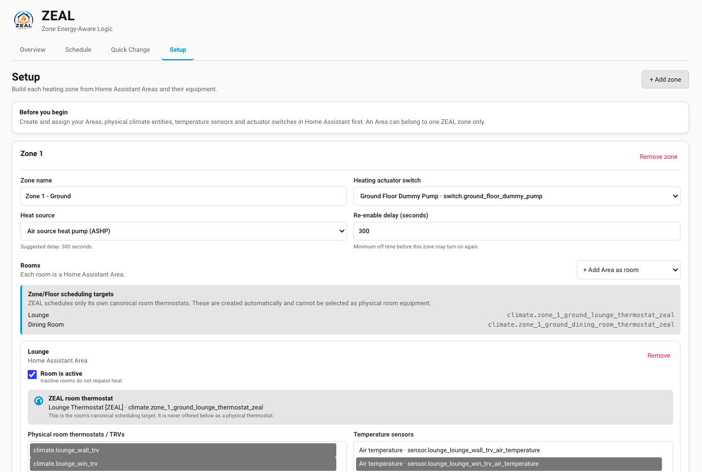
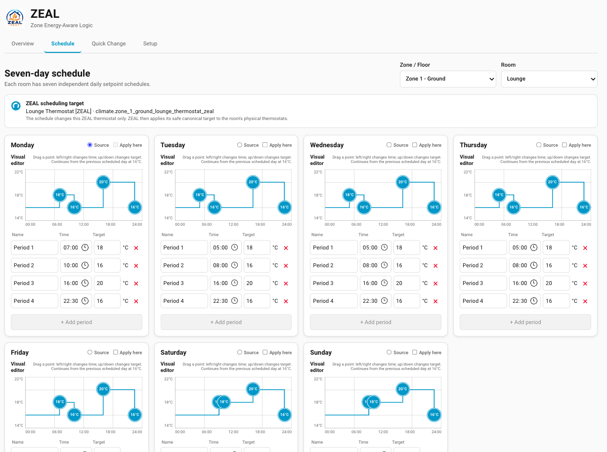
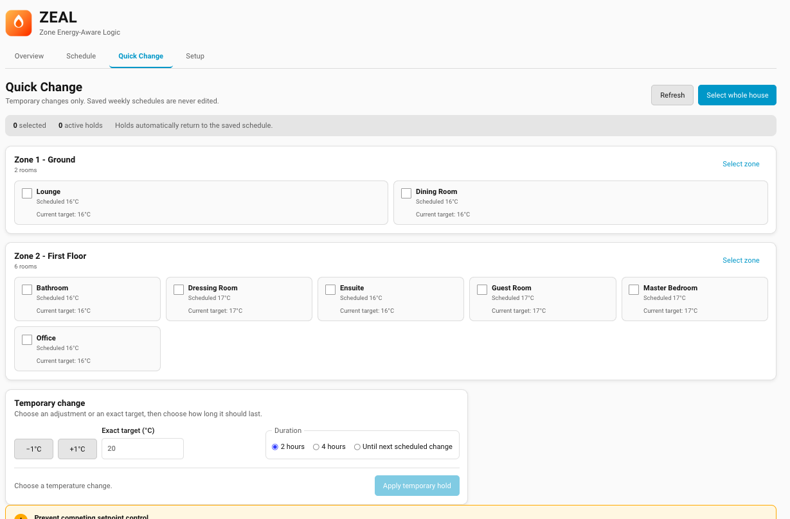

<p align="center">
  
</p>

<h1 align="center">ZEAL</h1>
<p align="center"><em>Zoned, Efficient, Adaptive, Learning — V1 release candidate</em></p>

<p align="center">
  Zone-based heating control for Home Assistant — configure zones, rooms, TRVs and
  temperature sensors entirely through the native HA UI. No AppDaemon, no separate
  webserver, no custom card required to get started.
</p>

> **ZEAL V1 release candidate — live regression testing is in progress.** The
> current candidate is on `main` at manifest version `0.15.0`. It is feature
> complete for V1 but is not yet the production `1.0.0` release. Test with
> dummy or spare equipment and complete the live acceptance record before
> unattended use. The earlier rename is breaking for any old config entry:
> Home Assistant treats the domain as part of a config entry's stored identity,
> so an install set up under the old `ashp_zone_control` domain will not
> automatically pick up as `zeal` — remove the old integration instance and
> add it fresh under the new domain.

## Current capabilities

ZEAL provides zone/room equipment setup, canonical synchronized room
thermostats, safe demand/actuator control, seven-day schedules, Quick Change,
Away mode and opt-in Schedule Adaptation Learning. Overview is available to
every signed-in user; Setup remains administrator-only. Administrators can grant
standard users Schedule and Learning access and/or Quick Change access.

The [ZEAL wiki](../../wiki) owns current user instructions and troubleshooting.
Code-adjacent architecture, schemas, tests and release evidence remain in this
repository. See the wiki's
[Documentation Ownership](../../wiki/Documentation-Ownership) map.

<details>
<summary>Archived pre-V1 feature and migration detail</summary>

The material below is retained temporarily for information-loss cross-checking.
It is not the maintained user manual; use the wiki links above for current
guidance.

## What it does (today)

- Define **Zones** — a Zone is whatever grouping makes sense for your house (e.g.
  "Ground Floor", "First Floor"), not tied to a single Home Assistant Area.
- Assign **Rooms** to each zone — a Room is an HA Area (Kitchen, Lounge, Bedroom...).
  An Area can only belong to one zone at a time.
- Pick each zone's **heating actuator switch** — one per zone (a shared single-pump
  house might have two zones sharing conceptually different floors, a dual-pump
  house one switch per zone, a hotel one switch per level — but a zone always has
  exactly one switch).
- Pick each zone's **heat source** (ASHP, modulating/condensing boiler,
  non-condensing boiler, or other) — used to suggest a sensible starting
  **re-enable delay** for that zone (see
  [Heat sources and heating profiles](#heat-sources-and-heating-profiles)
  below), which you can then change to any value you want.
- TRVs and temperature sensors are **auto-discovered** per room from whatever's
  already assigned to that Area in Home Assistant, pre-selected, editable.
- Mark a room **active/inactive** — an unoccupied guest room, for example, can be
  excluded from heating demand without removing its configuration.
- A saved-configuration summary (zones → switch → heat source → re-enable delay
  → rooms → active TRVs/sensors) is shown after every save.
- Every room with a TRV gets its own **Thermostat** entity — the room's actual
  setpoint, not any individual physical TRV. Change it (or physically adjust any
  TRV in the room) and every TRV in that room follows automatically, kept in sync
  by the Coordinator. ZEAL ignores only the immediate state echo of its own write;
  later manual changes are always accepted, and a TRV that was unavailable is
  restored from the room Thermostat when it reconnects. Rapid updates are
  coalesced per room so slow radio acknowledgements cannot replay obsolete
  temperatures or create a feedback loop. A physical dial must also remain
  stable for five seconds before ZEAL writes its final target to the room's
  other TRVs, preventing intermediate dial positions from draining batteries.
- A **Coordinator** evaluates every active room every 60 seconds (and instantly on
  any tracked TRV/sensor state change), turns each zone's heating switch on when
  any active room is colder than its room Thermostat's target, and off when none
  are — with a **re-enable delay** (per zone, editable — suggested default depends
  on heat source) after switching off, so a zone can't rapidly cycle.
- If **every TRV in a zone is closed** (valve shut), the pump is forced off
  immediately regardless of temperature demand — running against a fully closed
  loop with nowhere for water to go risks dead-heading the pump. Turning back on
  once any valve reopens still respects the normal re-enable delay.
- A **battery-dead, unavailable, or stalled TRV/sensor** gets a persistent
  notification (debounced ~5 minutes to ignore brief mesh blips) naming
  exactly which entity and whether other TRVs/sensors still cover that room —
  dismissed automatically the moment it recovers. Catches Zigbee's specific
  failure mode too, not just outright unavailable: a device that's silently
  stopped reporting while its last value still looks normal (Z-Wave reliably
  marks a dead node unavailable; Zigbee doesn't). The room itself degrades
  gracefully the whole time (other sensors keep averaging, other TRVs keep
  responding, and a stalled reading is never trusted for a real decision) —
  this only adds visibility on top, it doesn't change how the room is
  controlled.
- Every setpoint is clamped to a sane 5–30°C range before it can reach a real
  TRV, logged loudly if it ever has to — a bug can't silently drive a room to
  an extreme value.
- Each zone gets a **Manual override switch** (created automatically) — turn it on
  to take that zone out of automatic control entirely.
- Each zone gets a **Demand sensor** showing `Demand` / `No demand`, with which
  rooms are asking for heat as an attribute — a quick way to see what the
  Coordinator is doing without digging through logs.
- The **Schedule** page provides seven independent daily timelines per room,
  with draggable points, exact entry, source-day application and room-to-room
  schedule copying. Administrators can grant standard users Schedule access
  from Setup; Setup itself remains administrator-only.
- **Overrides → Quick Change** applies a temporary adjustment or exact target to one room,
  a Zone/Floor selection, any group of rooms or the whole house for two hours,
  four hours or until the next scheduled change. Weekly schedules are not
  edited.
- **Overrides → Away mode** can follow a Home Assistant calendar or one exact start/end
  period and applies one safe global target to every active room.
- Opt-in **Learning** records qualifying manual intent, shows progress toward
  the three-date threshold and presents reviewable Schedule Adaptation
  suggestions. ZEAL never changes the saved week without confirmation.
- **Setup → Downloads** exports the saved configuration/schedules and the most
  recent 500 canonical thermostat application outcomes as readable JSON files.

## What it doesn't do yet

- No dashboard card yet — administration happens in ZEAL's own Home Assistant
  panel.
- The ZEAL panel is currently English. The standard Home Assistant setup flow
  includes ten European-language files.
- The final V1 release still requires Block 10 live acceptance and release
  preparation. ZEAL is distributed through HACS as a custom repository because
  its PolyForm Shield licence is not eligible for the default HACS store.

See [Roadmap](#roadmap) for what's planned and in what order.

## Before you trust this with real heating

The Coordinator has automated and deterministic development-environment testing,
but the combined V1 scheduler and HTML setup experience still requires full live
acceptance testing. A couple of behaviours worth checking against how you actually
want your system to work:

> **📛 Pre-v1 development notice: expect to delete and recreate zones after
> updates, repeatedly, until v1 ships.** This is still actively being designed
> and tested one stage at a time — schema fields get renamed, restructured, or
> given new required values as real testing on hardware surfaces what actually
> needs to change (see the switch-field example just below, and the Decisions
> Log in the project definition doc for the full history). Some of these changes
> are backward-compatible (existing zones keep working with sensible defaults);
> others are breaking and require reopening **ZEAL → Setup** to reassign a field or
> just deleting and recreating the zone from scratch. **Assume the breaking kind
> until v1 is actually tagged** — don't treat a forced reconfiguration as a bug,
> and don't build anything you depend on around a specific schema shape until
> then. Each release's notes (or the project doc's Decisions Log) will say which
> kind of change happened.

- **Rooms with more than one TRV or sensor.** The original setup was always exactly
  one TRV and one sensor per room. The new schema allows several of each: room
  temperature is the **average** of all usable sensors, while demand normally
  follows the room's canonical ZEAL thermostat target. The highest usable
  physical-TRV target is only a startup fallback before the canonical entity is
  available.
- **Switch field changed 16 Aug 2026 (breaking).** From a list (`switches: [...]`,
  supporting multiple switches per zone) to a single value (`switch: <entity_id>`)
  once it was confirmed a zone only ever has one heating actuator switch in
  practice. The old list key isn't read by the new code — open **ZEAL → Setup**
  and reassign each zone's switch after updating.
- **Heat-source and re-enable-delay fields added 16 Aug 2026 (non-breaking).** An
  existing zone just behaves as ASHP-with-300s-delay until you open ZEAL → Setup
  and change it.
- **First run drives real switches.** The moment this integration is reloaded with
  zones configured, the Coordinator evaluates and acts — it doesn't wait for you to
  press a "start" button. Test with dummy/spare TRVs and switches before pointing it
  at your actual heating actuators.

</details>

## Installation

### HACS (custom repository)

ZEAL is distributed through HACS as a custom repository. It does not appear in
the default HACS search results, but HACS still installs it and manages updates.

[](https://my.home-assistant.io/redirect/hacs_repository/?owner=Buster1959&repository=ZEAL&category=integration)

If the button is unavailable, add the repository manually:

1. Install HACS if it is not already installed, then open HACS.
2. Select ⋮ (top right) → **Custom repositories**.
3. Enter `https://github.com/Buster1959/ZEAL`.
4. Select **Integration** as the category, then select **Add**.
5. Open **ZEAL HVAC System** in HACS and select **Download**.
6. Restart Home Assistant.
7. Open **Settings → Devices & Services → Add Integration**, search for
   **ZEAL HVAC System**, and complete setup.

### Manual

1. Copy `custom_components/zeal` into your Home Assistant
   `config/custom_components/` directory.
2. Restart Home Assistant.

## Documentation

- [Wiki — Getting Started](../../wiki/Getting-Started)
- [Wiki — Instructions for Use](../../wiki/Instructions-for-Use)
- [Wiki — Troubleshooting](../../wiki/Troubleshooting)
- [Wiki — Documentation Ownership](../../wiki/Documentation-Ownership)
- [Live test plan](TEST_PLAN.md), [UI acceptance tests](docs/UI_ACCEPTANCE_TESTS.md)
  and [V1 acceptance record](docs/V1_ACCEPTANCE_RECORD.md)
- [Architecture](docs/ARCHITECTURE.md) and [data model](docs/DATA_MODEL.md)
- [Decision summary](docs/DECISIONS.md) and [V1 block plan](docs/PROJECT_PLAN.md)
- [ZEAL Learning roadmap](docs/LEARNING_ROADMAP.md) — Schedule Adaptation and
  per-room Thermal Response
- [Internationalisation roadmap](docs/I18N_ROADMAP.md)
- [Draft V1 release notes](docs/RELEASE_NOTES_V1_DRAFT.md)

## Interface tour

ZEAL uses one Home Assistant panel for Overview, Schedule, Overrides, Learning
and Setup. The screenshots below are from the generic V1 test
installation; see the [wiki Instructions for Use](../../wiki/Instructions-for-Use) for
the complete guided tour.

### Zone and room setup



### Seven-day schedule



### Quick Change interface



### Learning

When an administrator enables Schedule Adaptation, **Learning** shows captured
evidence, progress toward the three-date threshold, reviewable suggestions and
proposal history. A dedicated release screenshot is still required before V1.

<details>
<summary>Archived README manual, roadmap and troubleshooting detail</summary>

The maintained user instructions and troubleshooting are in the wiki. The
technical roadmaps and contracts linked inside this archive remain owned by the
repository.

## Configuration

All configuration is done via the UI — no YAML.

1. **Settings → Devices & Services → Add Integration → ZEAL HVAC System.**
   Give the integration instance a name (e.g. "ZEAL HVAC System").
2. Open **ZEAL** from the Home Assistant sidebar (or **Configure** on the
   integration card). **Overview** is available to every signed-in user and
   shows the current zones, rooms, actuators, heat sources, equipment counts
   and each room's latest successful ZEAL target change as local time and
   setpoint. **Setup** remains administrator-only.
3. Select **Setup**, then:
   - add a zone and give it a descriptive name (e.g. "Ground Floor");
   - select its single heating actuator switch and heat source;
   - review or change the suggested re-enable delay;
   - add Home Assistant Areas as rooms (an Area can belong to one ZEAL zone);
   - select the physical climate thermostats/TRVs and temperature sensors already
     assigned to each Area, and choose whether the room is active;
   - leave **Show ZEAL in the Home Assistant sidebar** enabled, or clear it if
     you prefer to open ZEAL only from the integration's **Configure** action;
   - select **Save setup**. The complete hierarchy is validated against Home
     Assistant before it is saved, and stale browser edits are rejected safely.

Return to **ZEAL → Setup** at any time to modify the configuration. Existing
configurations created with the former multi-page flow load into this panel
without conversion or re-entry.

ZEAL is classified as a Home Assistant hub because one entry coordinates
multiple zone devices, room thermostats, sensors and actuators. It therefore
appears on **Settings → Devices & Services → Integrations**, not Helpers.

You may add more than one ZEAL instance, for example one for a gas-boiler
system and another for an ASHP, provided their physical entities do not overlap.
The ZEAL header shows an instance selector when more than one is loaded. To
remove only the selected instance, open **ZEAL → Setup → ZEAL instance
management** and select **Delete this ZEAL instance**. ZEAL names the selected
instance and asks for confirmation before permanently removing its setup,
schedules and audit trail. Other instances are not removed. Use **Open
integration settings** in the same card to reach Home Assistant's native page,
where an individual instance can also be disabled or deleted.

The sidebar preference is saved per ZEAL instance. Because all instances share
one ZEAL panel link, that link remains visible while any loaded instance has
**Show ZEAL in the Home Assistant sidebar** enabled. Hiding the link does not
disable heating control; open the panel through **Settings → Devices & Services
→ ZEAL HVAC System → Configure**, enable the recovery checkbox and submit. You
can also open the full panel directly at `/zeal`.

### Scheduling

Open **ZEAL → Schedule**, choose a Zone/Floor and room, then build each day's
temperature changes. You can drag a point on the graph for quick 15-minute and
0.5°C adjustments, or enter an exact time and setpoint in the fields below it.
Each day supports up to four named changes. Select one **Source** day and one or
more **Apply here** days to reuse a daily pattern before saving. **Select all
days** and **Clear all days** manage every destination day except the Source.

A target remains active until the next scheduled change, including across
midnight and across an empty day. The graph shows the target carried in from the
previous scheduled day so the saved schedule and runtime behaviour remain easy
to compare. To reuse an entire week, expand **Copy this seven-day schedule to
other rooms**. This replaces only the selected rooms' schedules; their zones,
Areas, physical equipment and ZEAL thermostat identities stay unchanged.

Schedule edits are held in the browser until **Save schedule** is selected.
ZEAL detects if another browser or process has saved newer data and refuses to
overwrite it. The saved schedule is immediately handed to the running scheduler.
Entering Schedule refreshes the authoritative configuration so every saved
Zone/Floor remains available after a slower integration reload.

### Overrides — Quick Change

Open **ZEAL → Overrides → Quick Change** when you need a temporary target without changing
the saved week. Select individual rooms, a complete Zone/Floor, any mixture of
rooms or **Select whole house**. Then choose −1°C, +1°C or enter an exact target
from 5–30°C and choose **2 hours**, **4 hours** or **Until next scheduled
change**.

The room cards distinguish the scheduled target from an active temporary hold
and show when that hold will end. **Cancel hold** immediately returns one room
to its current scheduled target. Applying and cancelling holds is recorded in
the audit trail. A relative adjustment requires an active scheduled target;
an exact target can also be used when no period is currently active.

### Away mode

Open **ZEAL → Overrides → Away mode** and choose exactly one activation method:

- **Off** keeps the normal weekly schedule and Quick Change behaviour.
- **Home Assistant Calendar** activates Away whenever the selected `calendar`
  entity is `on`. A dedicated Local Calendar or holiday calendar is recommended
  so unrelated appointments cannot activate it.
- **Start and end date/time** activates Away for one exact period. Times are
  selected in five-minute intervals and interpreted in Home Assistant's
  configured time zone; the start is included and normal control resumes at the
  end.

Choose the global Away target (12°C by default) and save. Away already applies
to every active room in all zones; no separate per-zone action is required.
The setting, selected source and date range are persisted in the ZEAL
schedule document, included in the configuration download and reconciled when
Home Assistant restarts.

If you return early, select **End Away now** in the active Away banner. This
switches Away to Off immediately and resumes the next eligible control source;
you do not need to edit or wait for the calendar event or saved end time.

While Away is active, it controls active-room setpoints and new Quick Change
requests are blocked. A hold that already exists is paused and resumes when
Away ends if its expiry has not passed. A manual change to a ZEAL room
thermostat is reasserted to the Away target; under normal schedule control, a
manual thermostat change is respected until the next scheduled transition.

Control priority is deliberate: the per-zone **Manual override** remains the
highest actuator authority and leaves that zone's pump/relay untouched. For
room targets the order is **Away → Quick Change → manual thermostat change
until the next transition → weekly schedule**.

### Configuration and audit downloads

Open **ZEAL → Setup → Downloads** to download either JSON file:

- **Download configuration** contains the saved zones, Areas, physical
  equipment assignments, canonical ZEAL targets, seven-day schedules and a
  generated-at timestamp. Unsaved Setup edits are deliberately excluded.
- **Download audit trail** contains up to the most recent 500 canonical room
  target attempts, including time, room, previous/requested target, cause and
  outcome. It survives Home Assistant and integration restarts.

The files necessarily contain the entity IDs, room/zone names and temperatures
needed to diagnose the system. They do not contain Home Assistant credentials,
tokens or physical-TRV service payloads. Review them before sharing publicly if
your entity or room names reveal personal information.

ZEAL keeps two thermostat roles deliberately separate. Each saved room with a
physical thermostat receives one automatically generated **ZEAL room
thermostat**, shown in the Zone/Floor scheduling-target summary; this is the
canonical target used by ZEAL scheduling. The room equipment picker shows only
non-ZEAL physical thermostats/TRVs assigned to that Area. ZEAL-owned entities
are also excluded from the temperature-sensor list. Filtering uses Home
Assistant's entity-registry owner (`platform`), not names such as `[ZEAL]`, so a
renamed entity cannot bypass the safety boundary.

> **Avoid competing schedulers:** do not assign a thermostat to more than one
> thermostat setpoint scheduler. If ZEAL and another integration, automation,
> blueprint or schedule both change the same thermostat's target temperature,
> they may repeatedly overwrite each other. Before enabling ZEAL scheduling,
> disable any other setpoint scheduler controlling those thermostat entities.

## Heat sources and heating profiles

Every heat source — ASHP, gas boiler, oil boiler — delivers heat to your
radiators differently, and that difference matters for one specific
setting: how long a zone's switch stays off before it's allowed to turn
back on (the **re-enable delay**), which exists to stop a zone rapidly
flicking on and off.

**Air source heat pump (ASHP).** Runs at much lower flow temperatures than
a boiler (commonly 30–45°C) and modulates its output continuously rather
than switching fully on or off — it's designed for long, steady, gentle
runs. Short-cycling is genuinely harmful here: it stresses the compressor
and can force wasteful defrost cycles. **Suggested delay: 300 seconds (5
minutes).**

**Modulating / condensing boiler (gas or oil).** Adjusts its output to
roughly match how much heat the building is losing, instead of firing at
one fixed temperature. No compressor to protect, but a condensing boiler's
efficiency is *higher* at lower return temperatures — so it still runs
better satisfying demand steadily rather than being kicked on and off
rapidly. **Suggested delay: 120 seconds.**

**Older non-condensing boiler (gas or oil).** Fires at a fixed, higher
flow temperature (often 70–80°C) and has no modulation — it's built to
switch fully on, satisfy the call for heat, and switch fully off. This is
just how it's meant to work; there's little to protect by delaying a
restart. **Suggested delay: 60 seconds.**

**Other / not sure.** Falls back to the original 300-second default.

These are **starting points**, not settings baked into the heat-source
choice — the actual delay is a plain editable number, pre-filled once when
you pick a heat source and left entirely up to you from then on. If your
specific equipment's manual gives a different minimum cycle time, use
that instead.

### Requirements

- Home Assistant with at least one **Area** defined (Settings → Areas & Zones) for
  each room you want to configure.
- Celsius targets; the ZEAL V1 schedule editor and control model use °C.
- A `switch` entity per zone to act as the heating actuator (e.g. a smart relay or
  your ASHP's zone valve control) — exactly one per zone.
- `climate` entities (TRVs) and `sensor` entities (temperature, `device_class:
  temperature`) assigned to the relevant Areas, so they can be auto-discovered.

## Roadmap

| Milestone | Status |
|---|---|
| 1. Skeleton integration, Config Flow, Store-backed data model | Done |
| 2. Coordinator — the actual control loop (reads TRVs/sensors, drives switches, per-zone editable re-enable delay suggested from heat source to prevent short-cycling, per-zone manual override switch, single-switch-per-zone schema) | Built with automated and deterministic development-environment coverage |
| 3. HTML Overview and Setup panel for zone/room/TRV/sensor management | Done on the V1 feature branch |
| 4. Scheduling (day/time/setpoint grid), calendar/date-range away mode, multi-TRV propagation | Model, runtime, secure panel API, seven-day visual Schedule panel, Quick Change, downloads, Away mode and precedence complete |
| 5. Polish — diagnostics, translations, entity icons and documentation | Diagnostics, brand icon, setup-flow translations and aligned V1 documentation done; privacy-reviewed desktop screenshots added, mobile captures pending |
| 6. HACS distribution, including the full ZEAL rename (domain, files and repository) | Custom-repository metadata, one-click installation and validation workflows done; the PolyForm Shield release remains outside the default HACS store |
| 7. ZEAL Learning — Schedule Adaptation | Implemented behind an administrator-controlled opt-in: retain source-aware manual/Quick Change history, detect three comparable changes across distinct days in 21 days, and ask an authorised user whether to commit the exact proposal to the weekly schedule. Suggestions are never auto-applied. |
| 8. ZEAL Learning — Room Thermal Response | Next major version, planned: learn each room's heat-up delay/rate and heat loss against observed outdoor temperature, then recommend optimum heating start from an hourly forecast. |
| — ASHP heating + cooling (long-term goal, contingent on a physical cooling-radiator retrofit) | Schema reserved (hidden, unused), design not finalised — see project doc §10 |

### ZEAL Learning — Schedule Adaptation

The learning layer uses a persistent, bounded audit of Quick Change, Home
Assistant thermostat and physical-TRV setpoint changes. A candidate is created
when a room receives three similar manual changes on any three distinct dates
within 21 days for the same comparable schedule period while that room's
schedule is unchanged.
Temperature and timing adaptations remain separate; accepting changes only the
weekday on which the proposal was raised.

The Learning Notifications page shows the evidence, affected room/day/time,
existing setpoint, suggested setpoint and confidence/count. An authorised user
can accept, edit and accept, dismiss, snooze, open Schedule or revert an
accepted proposal. Only explicit acceptance commits a new schedule revision;
learning never silently rewrites the saved week. Administrators can separately
enable Home Assistant persistent-notification alerts for new advice.

### ZEAL Learning — Room Thermal Response

ZEAL will optionally learn a separate thermal-response model for each room from
valid heating episodes and actual outdoor temperature observations. A local
outdoor sensor is preferred; otherwise Setup can select a compatible Home
Assistant weather entity, with a separate optional hourly forecast source.

The first application is optimum start: estimate when heating should begin for
the room to reach its existing scheduled temperature at the existing scheduled
time. Start with an explainable first-order thermal model, not PID; PID remains
a later possibility only for hardware with a genuinely proportional output.
Weather providers are selected through Home Assistant's standard entity
capabilities rather than a fixed allow-list. See the
[ZEAL Learning roadmap](docs/LEARNING_ROADMAP.md) for the model, observations,
provider test matrix, confidence rules and safety gates.

## Troubleshooting

**Several “ZEAL entity health warning” notifications appeared together.** ZEAL
now states the exact reason in each notification. `unavailable` or `unknown`
comes directly from Home Assistant; “has not reported a state” means the
entity's Home Assistant state is older than the four-hour stale threshold. A
further five-minute debounce prevents brief interruptions from notifying. This
is based on entity state reports, not battery percentage. Check the named
entities in Developer Tools and download diagnostics before deciding whether
the integration or device is at fault. The message also states whether another
usable TRV or sensor still covers the room.

**A room's setpoint got silently changed to 5°C or 30°C, with a WARNING in
the log about a clamped out-of-range value.** As of version 0.11.0, ZEAL
actively enforces a 5–30°C sane range on every setpoint before it can reach
a real TRV — not just declared as UI metadata, genuinely blocked. If you see
this warning, something upstream produced a value outside that range; it's
worth investigating what did, since this should never happen in normal
operation. The room itself is safe either way — it got clamped to a sane
edge value, not the bad one.

**Old zone/room devices or entities still showing after a rename or removal.**
Fixed as of version 0.10.0 - versions before that never cleaned up a
device/entity when a zone or room was removed via the old Configure flow, so
renaming-by-recreating (rather than editing in place) left the old one
behind permanently. Update and restart once; existing ghost
devices/entities get cleaned up automatically on that first restart, no
manual deletion needed. If it persists on 0.10.0+, check `Settings →
Devices & Services → ZEAL HVAC System` shows exactly as many devices as
zones actually shown in ZEAL → Setup — if not, that's worth reporting.

**A room's Thermostat entity is stuck, or logs show a repeating stack trace
between `climate.py` and `coordinator.py`.** Fixed as of version 0.9.0 - this
was a real bug where a `ZealRoomThermostat` could end up selected as one of
its own room's TRVs (most likely if you'd assigned the thermostat entity
itself to that room's HA Area), causing it to propagate a setpoint to
itself infinitely. Update to 0.9.0+, then open **ZEAL → Setup** for the
affected room and re-save its TRV list — the entity will no longer be
offered as an option. Check `Settings → Devices & Services → ZEAL HVAC
System → ⋮ → Download diagnostics` afterward to confirm; it flags directly
whether any configured TRV is one of ZEAL's own entities. As of 0.9.1,
ZEAL's own room thermostats also display with a `[ZEAL]` suffix (e.g.
"Living Room Thermostat [ZEAL]") specifically so they're visually
distinguishable from a same-named real/dummy TRV in any entity picker —
though the actual protection against this mix-up doesn't rely on that
suffix; it's a separate, more reliable check under the hood.

**Want to see everything currently configured at a glance.** Open the
**ZEAL → Overview** panel. `Settings → Devices & Services → ZEAL HVAC System
→ ⋮ → Download diagnostics` also provides a structured JSON dump of every
zone, room, TRV/sensor with live state, and each room's thermostat target
and mode for troubleshooting.

**Seeing no log output at all, even though the integration is running.** This
is expected, not broken — almost everything ZEAL logs is at `debug` level, and
Home Assistant doesn't show `debug` messages by default. Two ways to turn it on:

- **Quick, one-off (resets on restart):** `Settings → Devices & Services →
  ZEAL HVAC System → ⋮ → Enable debug logging`, then watch it live at
  `Settings → System → Logs`.
- **Persistent across restarts, for active development:** add this to
  `configuration.yaml`:
  ```yaml
  logger:
    default: info
    logs:
      custom_components.zeal: debug
  ```
  Restart Core to apply it.

Once enabled, you'll see a line for every evaluation cycle, every room's
setpoint/temperature/demand decision, every TRV setpoint propagated, every
switch turned on or off, and why (delay-blocked, override active, etc.) — the
Coordinator's actual decision trace, not just errors. A full startup banner
always shows at the default log level regardless — fenced with `====` lines
so it's unmistakable where a session starts in a scrolling log, listing every
zone (whether it's actually actioned — i.e. has a switch configured), every
room's active/inactive status, TRV/sensor entity_ids, and its registered
Thermostat entity, plus the exact `manifest.json` version that produced it.
Runs once per HA restart, right after everything's finished loading — reload
the integration or restart Core, then search your log for `ZEAL starting up`
to jump straight to it.

**The initial setup form shows raw keys or stale text after an update.** Custom
integration translations have two relevant caching details:

1. Custom integrations load `translations/en.json` at runtime, **not**
   `strings.json` — `strings.json` is just the editable source. If you edit
   `strings.json` and forget to copy the same change into
   `translations/en.json`, HA will show raw field/step keys because the file
   it actually reads never changed. Both files need to stay in sync; there is no
   build step doing this automatically for a HACS-style integration. The test
   suite asserts that they are identical, so a missed copy fails automated
   testing rather than reaching a user.
2. Even with both files correctly in sync, Home Assistant caches a custom
   integration's translations — a config-entry *reload* alone won't pick up the
   change. Do a full HA Core **restart**, then a hard refresh of the browser tab
   (Ctrl+Shift+R / Cmd+Shift+R) to clear the cached bundle.

**An Area doesn't show up as a room option.** Make sure it's defined under
Settings → Areas & Zones, and that at least one entity (TRV, sensor, or anything
else) is assigned to it — an Area with nothing in it still works as a room, but
won't have anything to auto-discover.

</details>

## Contributing

Issues and pull requests welcome. This is a V1 release-candidate project moving
through live regression and release gates — see the acceptance record for
current status.

Before opening a PR: `pip install -r requirements_test.txt && pytest tests/ -v`
— covers the Coordinator's core demand logic in under a second. See
`tests/README.md` for what's covered and the norm for adding a test alongside
any bug fix.

## License

[PolyForm Shield 1.0.0](LICENSE) — free to use, modify, and distribute for any
purpose, including commercially, with one restriction: you can't use it to build
a competing product. See the [LICENSE](LICENSE) file for the full, official text.

The [wiki](../../wiki) is a separate Git repository. Clone both for complete
offline user and technical documentation:

```bash
git clone https://github.com/Buster1959/ZEAL.git
git clone https://github.com/Buster1959/ZEAL.wiki.git
```
