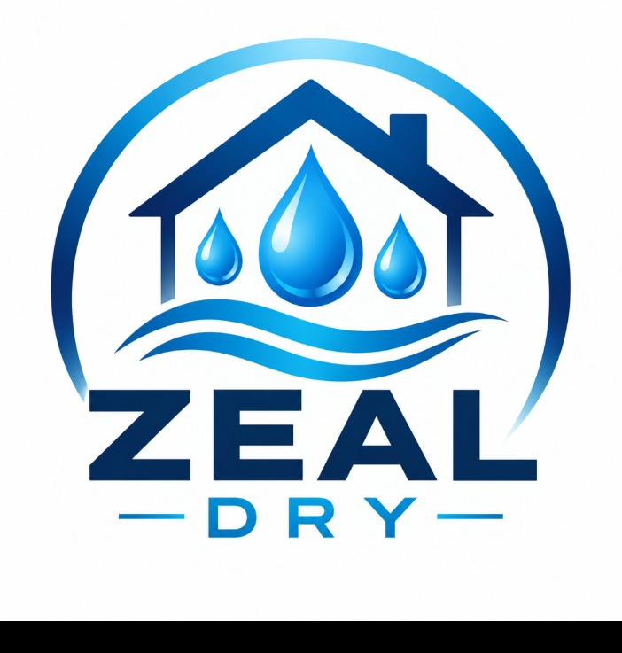

# ZEAL-Dry brand identity

The approved master artwork is
[`brand/ZEAL-Dry-logo-approved.png`](brand/ZEAL-Dry-logo-approved.png). It is
the authoritative ZEAL-Dry identity and must be used without redrawing or
simplifying it as SVG artwork.

## Master artwork

The artwork includes the polished house outline and chimney, three glossy blue
water droplets, flowing blue wave lines, the large ZEAL wordmark and the
`— DRY —` treatment. Preserve its proportions, white background and blue
colour treatment. Do not crop, stretch, recolour or substitute individual
elements.

## Home Assistant integration assets

The integration uses square renditions derived directly from the approved
master artwork:

- `custom_components/zeal/brand/icon.png` — 256 × 256
- `custom_components/zeal/brand/icon@2x.png` — 512 × 512
- `custom_components/zeal/frontend/zeal-dry-logo.png` — the square panel
  rendition served in the ZEAL-Dry header

The panel deliberately serves its bundled logo instead of relying on
`/api/brands/integration/zeal/icon.png`, so the approved artwork is available
with every custom-integration installation. These renditions retain the logo
itself and omit only the black export footer present in the supplied source
file.

## Superseded artwork

`assets/zeal-brand.svg` is retired. Its preserved copy in
`docs/drawings/zeal/` is historical reference only and must not be used in new
documentation or product surfaces.
