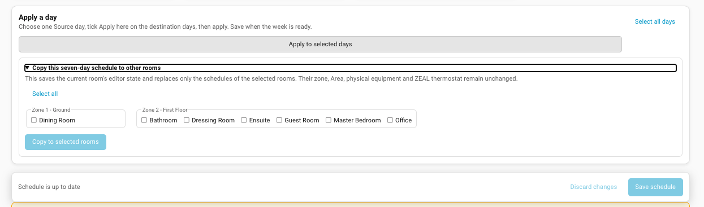
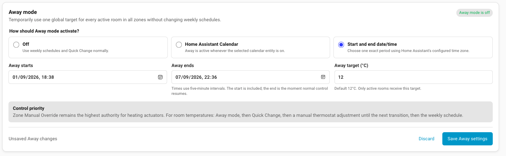

# ZEAL Instructions for Use — V1 Draft

> **Archived repository snapshot.** The maintained source of truth is now the
> [ZEAL wiki Instructions for Use](https://github.com/Buster1959/ZEAL/wiki/Instructions-for-Use).
> This snapshot is retained during the documentation transition so information
> remains available offline and can be cross-checked. Do not update it as a
> second manual; update the wiki owner page instead.

ZEAL combines room thermostats, heating-demand control and a weekly visual
scheduler in one Home Assistant integration. V1 is still being prepared; use
dummy or spare equipment first and complete the live test plan before relying
on it for unattended heating.

## Before installing

- Create a Home Assistant Area for every room you want ZEAL to control.
- Assign each physical climate thermostat/TRV and temperature sensor to its
  room Area.
- Have one Home Assistant `switch` entity for each zone's pump, relay or other
  heating actuator.
- ZEAL V1's scheduler and setup panel use Celsius targets.
- Disable any other scheduler, automation or blueprint that changes the same
  thermostat setpoints. Competing writers can overwrite each other.

## Install

ZEAL is distributed through HACS as a custom repository. Use the one-click
button or follow the manual steps below:

1. Install HACS if it is not already installed, then open HACS.
2. Select ⋮ (top right) → **Custom repositories**.
3. Enter `https://github.com/Buster1959/ZEAL`.
4. Select **Integration**, then select **Add**.
5. Open **ZEAL HVAC System** in HACS and select **Download**.
6. Restart Home Assistant.
7. Open **Settings → Devices & Services → Add Integration**, search for
   **ZEAL HVAC System**, and complete setup.

ZEAL does not appear in the default HACS search results. Once its custom
repository has been added, HACS installs and updates it normally.

For a manual installation, copy `custom_components/zeal` into
`config/custom_components/zeal` and restart Home Assistant.

Give the integration instance a name and finish. ZEAL appears in the sidebar
for Home Assistant administrators and on **Devices & Services → Integrations**.
It is a hub integration because one entry coordinates multiple zone devices,
room thermostats, sensors and actuators; it is not listed under Helpers.

## Set up zones and rooms

Open **ZEAL → Setup**. Add a Zone/Floor, select its single heating actuator and
heat source, then review the suggested re-enable delay. Add one or more Home
Assistant Areas as rooms and choose the non-ZEAL physical thermostats/TRVs and
temperature sensors in each Area. Optionally attach one or more window/door
contact sensors. Mark unused rooms inactive and save.

Setup and the **Modify setup** action are shown only to Home Assistant
administrators. Setup's **Standard-user access** card lets an administrator
separately allow standard users to use Schedule and Overrides; both are off
until deliberately enabled. Standard users who are allowed into Overrides can
use Quick Change, while Away Mode configuration remains administrator-only.
Schedule permission also includes full Learning access when Learning is
enabled: the user can inspect Learning evidence and history and can accept,
edit and accept, snooze, dismiss or revert Schedule Adaptation proposals.
Overview remains available to every signed-in user. The Overview updates demand,
actuator state and any active re-enable countdown automatically; it does not
need a manual refresh control.

The physical equipment picker intentionally excludes ZEAL's own room
thermostats. After saving, use **Overview** to confirm the hierarchy, actuator,
heat source, delay and equipment counts. Each Zone/Floor card also shows the live
heating-actuator state and a horizontally scrollable room-demand strip. Every
room is labelled Demand, Satisfied, Window/door open, Off, Inactive or
Unavailable alongside its current setpoint and measured temperature, making it easy to see why a zone is
heating. Heat demand and physical actuator state are displayed separately: a
zone can have demand while its actuator is still off during the re-enable delay
or because Manual Override or a safety condition is holding it. While demand is
calculated, a room with any configured window/door sensor reporting open is
shown distinctly and temporarily contributes no heat demand. Its thermostat
target is not changed.
While waiting for the re-enable delay, the card shows the live seconds remaining. It
also identifies Zone Manual Override and the all-TRVs-closed safety hold by name,
so a normal delay is not mistaken for a fault. Each room also separates its last
scheduled setpoint from the currently effective control source. Manual Home
Assistant/TRV adjustments are shown as lasting until the next scheduled change;
Quick Change shows its target and selected two-hour, four-hour or next-schedule
duration.

Setup also contains **Show ZEAL in the Home Assistant sidebar**. Clear it and
select **Save setup** if you do not want a permanent sidebar link. ZEAL keeps
running. To restore the link, open **Settings → Devices & Services → ZEAL HVAC
System → Configure**, enable the recovery checkbox and submit. The full panel
also remains available directly at `/zeal`.

## Build and copy schedules

Open **Schedule**, choose a Zone/Floor and room, and add up to four changes to
each day. Drag graph points for quick changes or enter the exact time and target
below the graph. Select one Source day and any Apply-here days to copy a daily
pattern before saving. Use **Select all days** or **Clear all days** for every
destination except the Source.

The last target carries across midnight and empty days. To reuse a full week,
expand the room-copy section and select destination rooms. Their names, Areas,
equipment and canonical thermostats do not change.

Expand **Copy this seven-day schedule to other rooms** to choose destination
rooms without changing their equipment or identity:

## Make a temporary Quick Change

Open **Overrides → Quick Change**, select one room, a Zone/Floor, several rooms
or the whole house, then choose −1°C, +1°C or an exact target. Select two hours,
four hours or until the next schedule transition. Cancel a room's hold to return
it to the current weekly target. The saved schedule is never edited.

## Use Away mode

Administrators can open **Overrides → Away mode** and select Off, a dedicated
Home Assistant Calendar, or one exact start/end period. Manual date/time choices
use five-minute intervals. Choose the global Away target and save. Away applies
to every active room in all zones; no separate zone selection is needed. If you
return early, select **End Away now**; normal control resumes immediately.

While Away is active, new Quick Changes are blocked. Existing holds pause and
resume afterward only if they have not expired. The Away banner's **Away
settings** button also opens Overrides rather than Setup.

## Review Learning suggestions

An administrator enables **ZEAL Learning — Schedule Adaptation** in Setup. The
same card can enable or disable the aggregated Home Assistant persistent
notification that points users to new advice. Learning is disabled by default
and never changes a schedule automatically.

<!-- SCREENSHOT NEEDED: docs/images/zeal-learning-setup-settings-desktop.png
Capture Setup's complete ZEAL Learning card and enough surrounding context to
show where it appears. Use a generic test installation with no personal room or
entity names. -->

Open **Learning** to review qualifying manual thermostat/TRV and Quick Change
evidence. A suggestion requires comparable changes for the same room and exact
schedule period on three distinct dates within the 21-day observation window.
The dates do not have to share a weekday. Changes made during Away remain in
the audit as excluded evidence and do not count.

The evidence-progress section shows which rooms and patterns are accumulating
qualifying dates, their current count and when the oldest evidence expires.
This is progress information only; ZEAL does not apply an incomplete pattern.

<!-- SCREENSHOT NEEDED: docs/images/zeal-learning-evidence-progress-desktop.png
Capture at least one incomplete pattern with its room, adaptation type, count
and expiry. Replace household-specific names with generic test names. -->

When a suggestion is ready, inspect its room, weekday, original period,
proposed time or temperature, confidence and supporting changes. Choose one of:

- **Accept** — apply the exact proposed edit to the evidenced weekday/period;
- **Edit and accept** — adjust the suggested time or temperature, confirm it,
  then apply that exact edit;
- **Snooze** — postpone the suggestion for seven days;
- **Dismiss** — reject it until materially new evidence accumulates;
- **Open Schedule** — leave the proposal unchanged and make a broader manual
  schedule edit instead.

Learning never offers matching weekdays automatically. To apply a similar
change to other days, use Schedule. Accepted proposals appear in history and
can be reverted while the affected period still matches the accepted value.

<!-- SCREENSHOT NEEDED: docs/images/zeal-learning-suggestion-desktop.png
Capture one actionable Schedule Adaptation proposal with supporting evidence
expanded and all decision buttons visible. Use generic room names and dates. -->

<!-- SCREENSHOT NEEDED: docs/images/zeal-learning-history-desktop.png
Capture proposal history containing safe examples of an accepted, dismissed or
snoozed outcome and the Revert action for an accepted proposal. -->

Learning records can reveal household routines. Administrators should grant
Schedule access only to users who may also view Learning history and make
Learning decisions. Ordinary Home Assistant diagnostics should be suitable for
support without exposing readable Learning evidence; use any future explicit
Learning export only after reviewing its privacy warning and contents.

## Download configuration and audit trail

Open **Setup → Downloads** and select **Download configuration** or **Download
audit trail**. The configuration export contains the saved hierarchy,
equipment, schedules and Away settings. The audit export contains up to 500
recent target attempts and outcomes.

Exports contain room/zone names and entity IDs, but no credentials or tokens.
Review them before sharing if your naming reveals personal information.

## Multiple ZEAL instances

Separate named ZEAL instances can control separate heating systems on one Home
Assistant machine. Their thermostats, sensors and actuators must not overlap.
Use the instance selector in the ZEAL header to change which one you are
viewing. To delete only the selected one, open **Setup → ZEAL instance
management**, select **Delete this ZEAL instance** and confirm the permanent
removal. Its setup, schedules and audit trail are deleted; other instances are
not changed. Select **Open integration settings** to use Home Assistant's native
page when you want to disable an individual instance instead.
The shared sidebar link remains visible while any loaded ZEAL instance has its
sidebar option enabled; it is hidden only when every loaded instance disables
the option.

## Mobile use

Use the Home Assistant Companion app or a mobile browser and open ZEAL from the
sidebar. The pages use a single-column layout on narrow screens. For accurate
editing:

- use exact time and target fields when dragging a graph point is awkward;
- scroll within the page rather than using browser zoom;
- save before leaving Schedule, Setup or edited Away settings in Overrides;
- use Quick Change in Overrides for routine temporary changes rather than editing a week;
- verify the confirmation or updated status after every save.

## Troubleshooting

See [Troubleshooting](TROUBLESHOOTING.md) for equipment discovery, cache,
logging, scheduling, Learning and Away checks. For a full dummy-system walkthrough, use
the repository [test plan](../TEST_PLAN.md).
