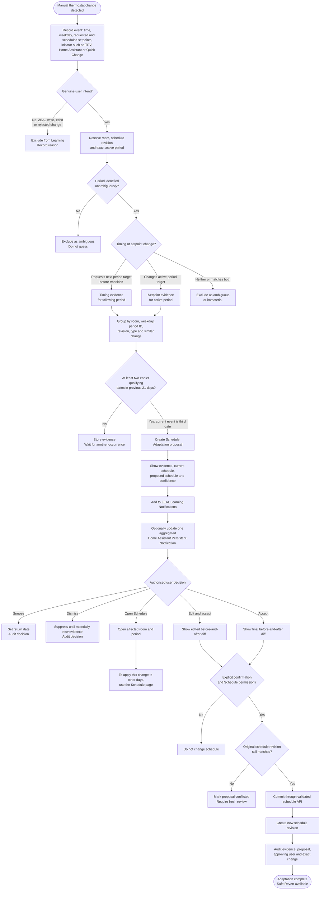

# ZEAL Learning Roadmap

ZEAL Learning is divided into two explainable, independently testable
workstreams. Schedule Adaptation has an initial complete implementation behind
an administrator-controlled opt-in; Room Thermal Response remains planned.
Neither workstream may silently alter the saved weekly schedule.

## 1. ZEAL Learning — Schedule Adaptation

Implementation status (`0.14.0`): capture, deterministic classification,
21-day/distinct-date pattern detection, persistent proposals, Learning
Notifications, optional Home Assistant persistent notifications, authorised
accept/edit/dismiss/snooze, revision-checked commit and guarded revert are
implemented. The initial threshold is three qualifying dates and the timing
window is 30 minutes. These values are constants pending sufficient validation
to justify exposing advanced tuning controls.

Schedule Adaptation learns from repeated user intent. It records source-aware
setpoint events from Home Assistant/canonical thermostats, physical TRVs and
Quick Change, always retaining the scheduled baseline that was overridden.

### Product boundary

Schedule Adaptation analyses heating habits, thermostat/TRV use and available
context, presents a personalised timing or temperature suggestion, requires the
user to accept it, and retains history so the result can be reviewed or
reverted. Every suggestion must show its supporting evidence and the exact
schedule diff before approval. ZEAL never changes a weekly schedule merely
because it detected a pattern, and learning must continue to work locally when
an external service is unavailable.

### Evidence captured

Each manual intent event should record:

- room, timestamp and Home Assistant time zone;
- scheduled setpoint and schedule period active at that moment;
- requested setpoint and the effective setpoint actually applied;
- source: canonical ZEAL thermostat, physical TRV, Home Assistant service/UI,
  Quick Change or another identifiable integration/automation;
- temporary-change duration or expiry, where applicable;
- room temperature, demand state, zone actuator state and Away state;
- observed outdoor temperature when a valid configured source is available;
- outcome, including applied, superseded, rejected, unavailable or reverted.

Events caused by ZEAL's own scheduled transition, setpoint echo or propagation
to physical TRVs are not user intent and must never count as supporting manual
evidence.

### Candidate patterns

The first implementation should detect two explainable proposal types:

1. **Temperature adaptation** — repeated manual changes to a similar target
   during the same room, schedule period and comparable time window.
2. **Timing adaptation** — repeated changes shortly before or after the same
   scheduled transition, suggesting that its start time is consistently wrong.

For example, if Lounge is scheduled for 20°C at 18:00 but is manually changed
to 21°C between 18:00 and 18:20 on three comparable days, ZEAL may propose
changing that period to 21°C. If the same change repeatedly occurs around
17:30, ZEAL may instead propose moving the 18:00 period earlier. ZEAL should not
combine different rooms, unrelated schedule periods, opposing adjustments or
events separated by a material schedule edit.

A candidate pattern is a configurable number of similar manual changes—for
example, three changes—within a comparable time window across a configurable
number of days. Once the evidence threshold is met, ZEAL creates a proposal
showing:

- the room and supporting audit events;
- the affected days and time window;
- the existing schedule time and setpoint;
- the proposed schedule edit and evidence count/confidence;
- Accept, Edit, Dismiss and Snooze actions.

Only Accept or Edit followed by confirmation writes a new schedule revision
through the existing validated API. Proposal creation and disposition are
audited, allowing ZEAL to suppress a dismissed pattern until materially new
evidence exists.

### Deterministic period-assignment algorithm

Learning must identify one exact schedule period before an event can become
evidence. A period starts at its scheduled time, inclusive, and ends at the next
period's start, exclusive. Each saved period needs a stable ID within its room,
weekday and schedule revision. An evidence event retains that ID plus an
immutable snapshot of the period start, next transition, scheduled setpoint and
revision; it is not reassigned later merely because the schedule changes.

For every external setpoint event, ZEAL applies these steps in order:

1. Reject ZEAL's own scheduled write, physical-TRV propagation and confirmed
   device echo.
2. Resolve the room, local weekday, event timestamp and schedule revision that
   were effective when the event occurred.
3. Identify the active period and the immediately following period from that
   saved revision.
4. Compare the requested target with the active and following scheduled
   setpoints.
5. Classify the event as **timing evidence for the following period** only when
   it occurs before that transition, falls inside the configured timing window
   and approximately requests the following period's target.
6. Otherwise classify it as **temperature evidence for the active period** when
   it materially differs from the active scheduled target.
7. Reject the event as ambiguous when ordering around a transition cannot be
   established, when it matches both interpretations equally, or when no exact
   period/revision can be recovered.

This prevents adjacent periods from being combined. Given `07:00 · 18°C` and
`08:00 · 20°C`, a change at 07:30 to approximately 20°C may support moving the
08:00 transition earlier; a different target at 07:30 belongs to the 07:00
period. A change after 08:00 belongs to the 08:00 period. Repeated adjustments
in both intervals form two independent evidence patterns. If an event occurs on
the boundary and ZEAL cannot prove whether the scheduled transition or manual
request happened first, that event contributes to neither pattern.

### Evidence grouping and day scope

Evidence is grouped by room, local weekday, original schedule-period ID,
schedule revision, adaptation type and similar requested change. Distinct
calendar dates for the same weekday can satisfy the repetition threshold; three
adjustments during one occurrence of a period count as one qualifying date.
Monday evidence does not count as Friday evidence even when both days happen to
have identical start times and setpoints.

A proposal changes only weekdays that independently contain qualifying evidence
for the same exact adaptation. It does not offer arbitrary additional weekday
checkboxes and does not extrapolate to structurally similar but unobserved days.
Broader copying remains an ordinary, deliberate Schedule operation. The proposal
shows this banner and action:

```text
Apply this change to other days
Learning suggestions include only days supported by qualifying evidence.
To apply this change to additional days, use the Schedule page.

[Open Schedule]
```

Opening Schedule does not accept the Learning proposal. It takes the user to the
affected room and period, where the existing copy-to-days workflow and normal
schedule validation apply. Any manual Schedule edit creates its own revision and
causes the outstanding proposal to be revalidated or marked stale.

### Schedule Adaptation decision flow

“Two or more in the previous 21 days” means two earlier qualifying calendar
dates plus the newly detected change, producing the default total of three.
Evidence must match the same room, weekday, exact period and adaptation type.



### Proposal experience

The Learning view should behave as an advice inbox rather than silently changing
control state. A proposal should read along these lines:

```text
Lounge · Evening schedule suggestion
You changed 20°C to 21°C between 18:04 and 18:16 on 4 of the last 6 comparable days.

Current: 18:00 · 20°C
Proposed: 18:00 · 21°C
Estimated effect: +1°C during this schedule period
Confidence: High
```

The user can inspect the evidence events, accept the exact change, edit it before
confirmation, dismiss it, or snooze it. Accepting creates a normal versioned
schedule revision and an audit entry linking the proposal, evidence IDs, old
value and new value. A one-action **Revert schedule change** remains available
from proposal history while the affected period still matches the accepted
revision; otherwise ZEAL shows the conflict and requires manual review.

### Suppression, confidence and safety

- Default minimum evidence is three qualifying events across three distinct
  calendar dates for the same weekday and exact schedule period; repeated
  adjustments during one occurrence cannot create a proposal.
- Confidence reflects evidence count, consistency of time/temperature change,
  data quality and how recently the events occurred—not an unexplained AI score.
- Dismissed proposals remain suppressed until sufficient materially new evidence
  accumulates. Snoozed proposals reappear only after their chosen date.
- Away periods, unavailable/stale temperatures, open-window events when known,
  competing scheduler activity and changes made during Setup/testing are excluded
  or clearly down-weighted.
- A schedule revision invalidates older unmatched evidence so ZEAL does not
  recommend undoing a change the user has already made deliberately.
- Suggestions never alter Zone Manual Override, safety holds, re-enable delays or
  the actuator-control precedence model.
- Learning can be disabled per room and globally. Disabling proposal generation
  does not silently delete the audit record; retention/deletion controls remain
  explicit.

### Schedule Adaptation acceptance gates

- Synthetic event streams deterministically produce the expected temperature or
  timing proposal and do not combine unrelated rooms or periods.
- Adjacent 07:00 and 08:00 periods retain separate evidence, including when both
  receive manual changes within the same morning.
- Unresolvable transition-boundary events are excluded rather than assigned to
  a convenient period.
- ZEAL-originated schedule writes and physical-TRV echoes never become evidence.
- Fewer than the configured number of distinct qualifying days produces no
  proposal.
- The proposal displays the exact current/proposed schedule diff and links every
  counted audit event.
- Unobserved weekdays are never included or offered by Learning; broader changes
  are handed off to the ordinary Schedule page without accepting the proposal.
- Accept and edited-accept use the existing validation and optimistic-revision
  checks; stale proposals cannot overwrite a newer schedule.
- Dismiss, snooze, accept, edit, conflict and revert outcomes are audited and
  survive restart.
- No proposal is applied without an authenticated, authorised user confirmation.
- Standard-user proposal visibility and approval are governed by the same
  administrator-controlled Schedule permission as ordinary schedule editing.

### Implementation and validation strategy

Schedule Adaptation will not be released as an observation-only feature before
the proposal workflow exists. A household with a stable schedule may make too
few natural adjustments to validate passive classification in a useful period.
The implementation therefore delivers one complete vertical pipeline:

```text
Capture → Classify → Detect → Recommend → Review → Confirm → Commit → Revert
```

Learning is disabled by default until an administrator enables it. Enabling it
allows automatic capture, detection and advice; it never authorises an automatic
schedule write. The safety boundary is explicit authenticated confirmation of a
visible schedule diff through the existing optimistic-revision API, not a delay
between observation and proposal generation.

Tests use synthetic, dated event streams that pass through the same production
capture, classification, grouping, proposal and commit code as real events. A
test-only fixture or in-memory event source may provide controlled timestamps
and sources, but production code must not contain a hidden UI or service for
forging learning evidence. Required programmatic scenarios include:

- three qualifying occurrences across three dates create one proposal;
- repeated adjustments during one occurrence count only once;
- adjacent periods, weekdays and schedule revisions never share evidence;
- timing and temperature interpretations remain distinct;
- ambiguous boundaries, ZEAL writes and device echoes are excluded;
- opposing or insufficient evidence creates no actionable proposal;
- accept, edited accept, dismiss, snooze, conflict and revert survive restart;
- an accepted proposal changes only its evidenced weekday and exact period;
- backend authorisation and optimistic revision checks cannot be bypassed.

Real-home testing then validates the full non-destructive recommendation
experience. A mistaken recommendation can be inspected and dismissed without
changing heating. No deliberate schedule disturbance or months-long passive
observation is a prerequisite for completing the implementation.

## 2. ZEAL Learning — Room Thermal Response

Room Thermal Response learns how each room and its surrounding building fabric
respond to heating under different outdoor conditions. Its first user-facing
application is **optimum start**: predicting when heating should begin so a room
reaches its scheduled target at the scheduled time.

### Weather and outdoor-temperature sources

Setup should select entities through Home Assistant's common interfaces rather
than hard-code provider names:

1. **Observed outdoor temperature** — preferably a local outdoor temperature
   sensor; otherwise the current temperature of a compatible `weather` entity.
2. **Optional forecast weather entity** — a `weather` entity that supports
   hourly forecasts through `weather.get_forecasts`.

Actual observed outdoor temperature trains the model. Forecast temperature is
used only when predicting a future heating start. Forecast values must not be
stored as if they were observations.

Initial compatibility testing should cover:

- [Met Office](https://www.home-assistant.io/integrations/metoffice/) — official
  Home Assistant integration with current conditions and hourly forecasts;
- [Open-Meteo](https://www.home-assistant.io/integrations/open_meteo/) — official
  integration with no account/API key requirement and hourly forecasts;
- [Pirate Weather](https://github.com/Pirate-Weather/pirate-weather-ha) — custom
  Home Assistant integration exposing weather data through the common entity
  model.

These are a compatibility test matrix, not a permanent allow-list. A later
provider should work without ZEAL-specific code when it exposes the required
standard entity attributes and hourly forecast capability. ZEAL should validate
capabilities when the entity is selected and clearly report missing or stale
data.

Home Assistant's current weather contract and forecast action are documented at
[Weather](https://www.home-assistant.io/integrations/weather/).

### Initial thermal model

Start with an explainable first-order resistance/capacitance model rather than
PID:

```text
C × dTi/dt = Qheat − H × (Ti − To) + disturbances
```

Where:

- `Ti` is room temperature;
- `To` is observed outdoor temperature;
- `Qheat` is effective heat input;
- `C` is effective room/building thermal mass;
- `H` is the room heat-loss coefficient;
- `C/H` is the thermal time constant;
- disturbances include solar gain, occupants, appliances and open windows.

For recorded samples, ZEAL can fit the discrete relationship:

```text
ΔTi / Δt = a × Qheat − b × (Ti − To) + error
```

This supports understandable estimates such as heat-up rate in °C/hour at a
given outdoor temperature, response delay, cooldown rate and predicted time to
target. Model parameters and confidence are per room; one room's result must not
be applied to another room merely because both share a zone.

PID is not the initial learning model. PID controls a continuously adjustable
output in real time and may later suit proportional valve position, fan speed or
heat-demand modulation. With V1's room setpoints, TRVs and mostly binary zone
actuators, a second PID could conflict with the TRVs or heat source's own
controller. Optimum-start prediction should come first.

### Observation record

Each sample or heating episode should retain enough provenance to reproduce the
result:

- room ID, timestamp and sample interval;
- room temperature at the start/end and its rate of change;
- observed outdoor temperature and source entity;
- scheduled and effective setpoint plus control source;
- room demand, zone actuator and thermostat/TRV state;
- heat-source type and, where available, flow temperature or modulation;
- optional valve position, window/door state, occupancy and solar/cloud data;
- sensor availability, staleness and exclusion reason;
- model version and the parameters/confidence produced from the observation.

### Data-quality exclusions

ZEAL should reject or down-weight episodes affected by unavailable/stale
sensors, an open window, an interrupted heating run, manual changes during the
episode, an unobserved secondary heat source or implausible temperature jumps.
Solar gain and occupancy should initially reduce confidence unless corresponding
data is available; they must not be mislabelled as radiator performance.

### User experience

Overview should progress from observation to an explainable recommendation:

```text
Thermal model: Learning — 12 valid heating cycles
```

then, for example:

```text
Thermal model: Established
Estimated heat-up rate: 0.62°C/hour at 5°C outside
Estimated start for 20°C by 07:00: 05:48
Confidence: Medium
```

ZEAL should first offer an optimum-start recommendation for review. Enabling
automatic optimum start must be a separate, explicit user choice after the room
model reaches a defined confidence threshold. The original scheduled target
time and temperature remain unchanged; optimum start changes only when heating
begins in preparation for that target.

### Acceptance gates

- Deterministic synthetic-room tests recover known thermal parameters within a
  defined tolerance.
- Provider contract tests cover Met Office, Open-Meteo and Pirate Weather-shaped
  weather entities without provider-specific control paths.
- Forecast values and actual observations remain distinguishable in storage.
- Restarts, missing forecasts and stale outdoor readings fail safely without
  losing the existing schedule.
- Model recommendations include evidence, model version and confidence.
- No schedule or heating start is changed without the required user approval.
- Learning history has bounded retention, export/redaction rules and an explicit
  occupancy-privacy warning.

## Sequencing

1. Ship and validate V1 without learning dependencies.
2. Implement the complete source-aware Schedule Adaptation vertical pipeline,
   including persistence, notifications, approval, commit and revert.
3. Validate that pipeline with deterministic synthetic event timelines and then
   the non-destructive proposal experience in a real Home Assistant installation.
4. Add outdoor-source selection and observation-only thermal data collection.
5. Validate per-room models offline before showing recommendations.
6. Release advisory optimum start.
7. Consider explicitly enabled automatic optimum start.
8. Consider PID only for future hardware with a suitable proportional output.
